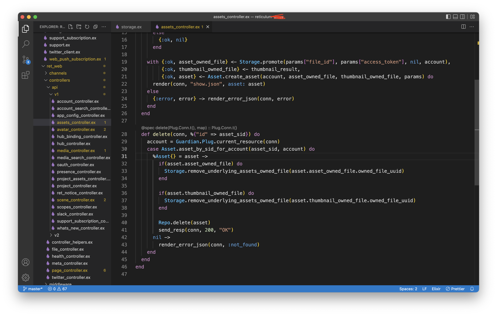

# The problem I still faced

## 1. 502 server communication error in hubs admin like this [issue](https://github.com/mozilla/hubs/issues/4970#issue-1087523703)

Ok, let's give try to solve this.

The problem is an API call to this route

`/api/ita/admin-info`

and other with slash ita `/ita`

if we check where is the code in the reticulum which handles that
open the `router.ex` ita API call the `RetWeb.Plugs.ItaProxy` if you in vs code you can command+click / ctrl+click for find the function is called.

```elixir

scope "/api/postgrest" do
   pipe_through([:secure_headers, :auth_required, :admin_required, :proxy_api])
   forward("/", RetWeb.Plugs.PostgrestProxy)
end

scope "/api/ita" do
   pipe_through([:secure_headers, :auth_required, :admin_required, :proxy_api])
   forward("/", RetWeb.Plugs.ItaProxy)
end

```

So it will open the `proxies.ex`

```elixir
defmodule RetWeb.Plugs.PostgrestProxy do
  use Plug.Builder
  plug ReverseProxyPlug, upstream: "http://localhost:3000"
end

defmodule RetWeb.Plugs.ItaProxy do
  use Plug.Builder
  plug ReverseProxyPlug, upstream: "http://localhost:6000"
end
```

### What is `localhost:3000`?

I have solved this [see](https://github.com/albirrkarim/mozilla-hubs-installation-detailed/blob/main/PROBLEM_SOLVED.md##what-is-port-3000)

### What is `localhost:6000`?

Hmmm, what is this?

## 2. File / Assets Not Fully Deleted (Only deleted in database record, Not in Actual Storage Directory)

From this [issue](https://github.com/mozilla/hubs/issues/5508)

The file that user delete is not fully deleted. It only deletes the record from the database. and not deleted completely in storage directory.

Expected behavior:
I want if the user press delete the record from the database and the Actual file in the storage folder is completely deleted.

So, You will pay expensive price to AWS amazon. More storage means more price.

I have solve this issue by editing reticulum.

On `/reticulum/lib/ret/storage.ex` i add aditional function

```elixir
  def remove_underlying_assets_owned_file(id) do
    try do
      path = owned_file_path()
      {:ok, uuid} = Ecto.UUID.cast(id)
      [_file_path, meta_file_path, blob_file_path] = paths_for_uuid(uuid, path)
      File.rm!(blob_file_path)
      File.rm!(meta_file_path)
      clean_empty_dirs("#{module_config(:storage_path)}/#{path}")
      clean_empty_dirs("#{module_config(:storage_path)}/#{expiring_file_path()}")
    rescue
      _ ->
        {:error, "Failed to remove underlying assets for cached file."}
    end
  end
```

And use that function like this



BTW you can doing `console.log` like in javascript by using `IO.inspect(VARIABLE_HERE)` in elixir, for getting the file id.

<br>
<br>

<a href='https://paypal.me/AlbirrKarim' target='_blank'></a>

<a href='https://ko-fi.com/Q5Q0BC92X' target='_blank'></a>

## Also read:

[How to Maintenance Server (Backup, etc)](https://github.com/albirrkarim/how-to-maintenance-server)

[Hubs Memory Efficiency & Usage Simulation (Private Repo)](https://github.com/albirrkarim/mozilla-hubs-optimization)

[Hosting Mozilla Hubs on VPS](https://github.com/albirrkarim/mozilla-hubs-installation-detailed/blob/main/VPS_FOR_HUBS.md)

[The Problem I Still Faced](https://github.com/albirrkarim/mozilla-hubs-installation-detailed/blob/main/PROBLEM_UNSOLVED.md)

[The Problem I Faced and I Already Solved](https://github.com/albirrkarim/mozilla-hubs-installation-detailed/blob/main/PROBLEM_SOLVED.md)

[Tips for Modification](https://github.com/albirrkarim/mozilla-hubs-installation-detailed/blob/main/HOW_TO_MODIFY.md)

[Overview System With Figma](https://www.figma.com/file/h92Je1ac9AtgrR5OHVv9DZ/Overview-Mozilla-Hubs-Project?node-id=0%3A1)

[Experience Sharing About Hosting on Other Server](https://github.com/albirrkarim/mozilla-hubs-installation-detailed/blob/main/EXPERIENCE.md)
